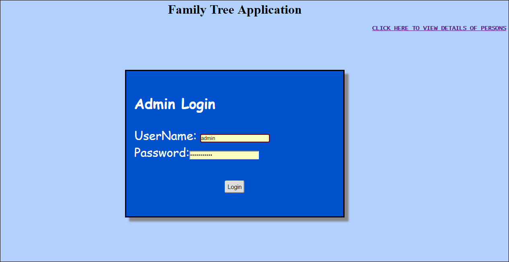
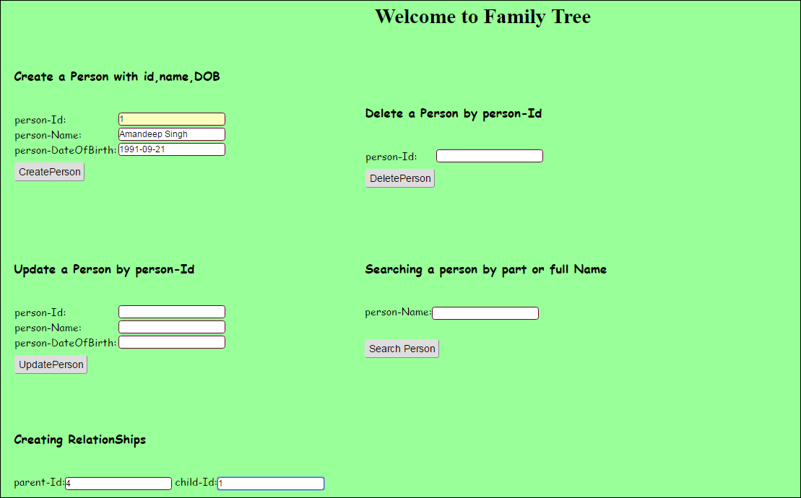
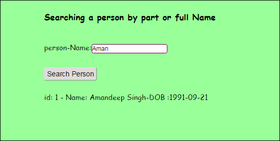

# Family-tree
This is a PHP web application that can store and display details of a family in the form of a family tree and helps to access details of a person in a very efficient manner.

###INITIAL DETAILS
The family Tree application has been built with PHP, HTML, Java Script and CSS. It contains a login page for the Admin. 

</img> 
After logging in the user can create a person and also update ,delete and search a person according to his full or partly mentioned name. The Admin has also got the rights to create relationships for the family tree. 

</img> 

###Searching  a person

</img> 

###View Details
An user can view details of the family tree from the VIEW DETAILS link on the right hand side of admin page. 

</img> 

###View GrandParents

</img> 

**Coming Soon-<b>The Family Tree</b> Visualization!
